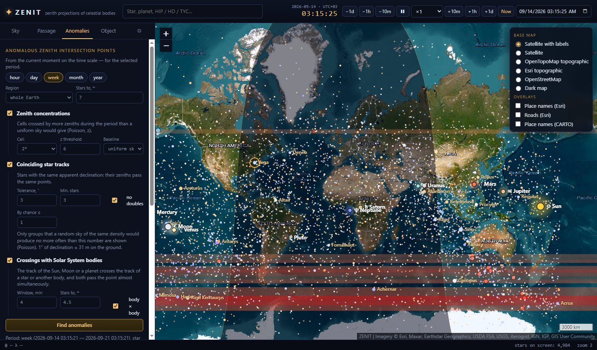
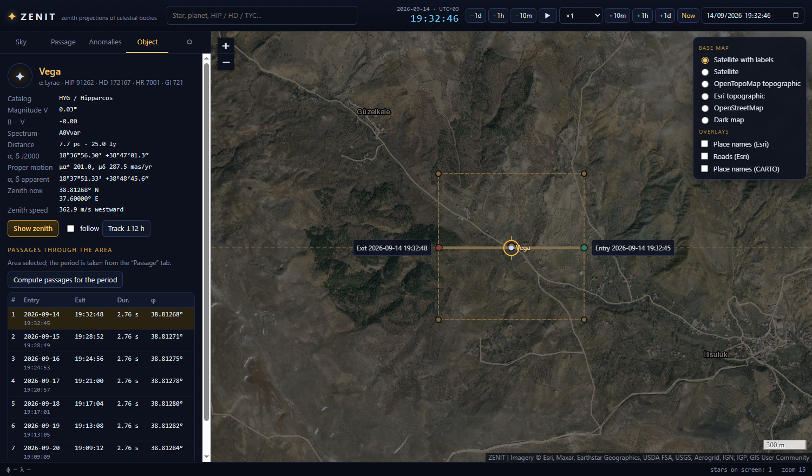

<p align="center"></p>

<h1 align="center">ZENIT</h1>

<p align="center">
  <b>Zenith projections of stars, the Sun, the Moon and planets on a real map.</b><br>
  Find when a star's zenith crosses your plot of land, draw its ground track, and hunt for anomalous zenith intersection points.
</p>

<p align="center">
  <a href="https://github.com/ignisdomini/zenith/releases/latest">Download for Windows</a> ·
  <a href="README.ru.md">Русская версия</a>
</p>

---



## What it does

Every celestial body is exactly overhead somewhere on Earth. That place — the **sub-stellar point** — has latitude equal to the body's apparent declination and longitude equal to its right ascension minus Greenwich apparent sidereal time. As the Earth turns, the point slides west at ~464 m/s × cos φ.

ZENIT puts those points on satellite imagery and topographic maps and answers practical questions about them.

- **Live zenith map** — 2.55 million stars (HYG v4.1 + Tycho-2, down to ~12ᵐ) and the Sun, Moon, Mercury…Pluto, with names, Bayer/Flamsteed designations, day/night terminator and a controllable time scale (pause, ×10…×86400, jump to any moment).
- **Passage through a ground area** — draw a rectangle or drop an N×N km square; ZENIT lists every star and body whose zenith crosses it in a period (hour … 20 years), with entry/exit date and time, duration and the ground track on the map.
- **Anomalous zenith intersection points** for an hour, day, week, month or year:
  - *zenith concentrations* — cells crossed by significantly more zeniths than a uniform sky would give (Poisson z-score, heat map);
  - *coinciding star tracks* — groups of stars with the same apparent declination whose zeniths pass the same points, kept only if a random sky would produce them less than once;
  - *crossings with Solar System bodies* — the Sun, Moon or a planet crosses a star's or another body's track and both pass the point within a time window (this finds, among other things, solar eclipses).
- **Export** of passages, tracks and anomaly points to **CSV, KML and KMZ** (Google Earth, QGIS, SAS.Planet…).
- **Base maps** — Esri satellite imagery with place names and roads, OpenTopoMap, Esri topographic, OpenStreetMap, dark map. Tiles are cached on disk; offline mode uses the cache only.
- **English and Russian** interface, selectable in the installer and in the settings.



## Accuracy

| Item | Model | Accuracy |
|---|---|---|
| Stars | ICRS J2000 catalog positions, proper motion, IAU 2006 precession + IAU 2000B nutation, annual aberration | ≤ 0.01″ vs. [astronomy-engine](https://github.com/cosinekitty/astronomy) reference (≈ 0.3 m on the ground) |
| Sun, Moon, planets | astronomy-engine (VSOP87, lunar theory), light time, aberration; zenith point solved on the WGS-84 ellipsoid | ≈ 1′ for planets |
| Earth rotation | Greenwich apparent sidereal time; user-set DUT1 = UT1 − UTC | 1 s of DUT1 = 15″ ≈ 460 m at the equator |

Not modelled: deflection of the vertical (up to 30″ in mountains), polar motion (~10 m), diurnal aberration (0.3″). Refraction is zero at the zenith.

`npm run verify` checks the star and body math against astronomy-engine.

## Install

Download `zenit-setup-<version>.exe` from [Releases](https://github.com/ignisdomini/zenith/releases) and run it. The installer asks for the language (English by default), lets you pick the folder and creates Start menu and desktop shortcuts. A portable `zenit-portable-<version>.exe` needs no installation.

The builds are not code-signed yet, so Windows SmartScreen may warn about an unknown publisher: click **More info → Run anyway**.

Requirements: Windows 10/11 x64, ~400 MB of disk space, Internet for base maps (the star catalog is bundled).

## Build from source

Requirements: Node.js 22+ and ~300 MB of free space for the catalog sources.

```bash
git clone https://github.com/ignisdomini/zenith.git
cd zenith
npm install
npm run catalog     # downloads HYG v4.1 and Tycho-2 (~200 MB) into data/ and builds catalog/ (~80 MB)
npm start           # run the app
npm run dist        # installer and portable exe in dist/
```

If npm skips Electron's install script, run `node node_modules/electron/install.js`.

Debug switches: `npm run debug` (DevTools + console log); `electron . --offscreen --eval=script.js --shot=out.png --quit` runs a script in the window and saves a screenshot without a display.

## How it is built

| Path | Purpose |
|---|---|
| `src/main/main.js` | Electron main process: `app://` protocol for app files and cached map tiles, settings, language, file saving |
| `src/main/zip.js` | minimal ZIP writer for KMZ |
| `src/renderer/js/astro.js` | apparent places, sub-stellar and sub-body points, interpolated frame tables |
| `src/renderer/js/catalog.js` | 32-byte binary catalog with a 1°×1° cell index, names and designations, search |
| `src/renderer/js/sky-layer.js` | Leaflet canvas layer: stars, bodies, terminator, grid, heat map |
| `src/renderer/js/search-worker.js` | Web Worker: zenith passages through an area |
| `src/renderer/js/anomaly.js` | anomaly detector (concentrations, track coincidences, crossings) |
| `src/renderer/js/i18n.js` | English / Russian strings |
| `tools/build-catalog.js` | downloads HYG and Tycho-2 and builds `catalog/stars.bin` + `names.json` |

The star math started as the "Sky map" module of the author's KARTOVED Android app and was extended with rigorous precession/nutation, aberration and ellipsoidal zenith points. Code comments are partly in Russian.

## Data and credits

- **HYG Database v4.1** — © David Nash ([astronexus](https://github.com/astronexus/HYG-Database)), CC BY-SA 4.0. The derived star catalog is distributed under the same license.
- **Tycho-2 Catalogue** — Høg et al. 2000, A&A 355, L27; [CDS I/259](https://cdsarc.cds.unistra.fr/viz-bin/cat/I/259).
- **astronomy-engine** — © Don Cross, MIT. **Leaflet** — BSD-2-Clause. **Electron** — MIT.
- Base maps — © Esri, Maxar, Earthstar Geographics; © OpenStreetMap contributors (ODbL); © OpenTopoMap (CC-BY-SA); © CARTO. Please respect the tile providers' usage policies and do not bulk-download tiles.

## License

Code — [MIT](LICENSE). Star catalog derived from HYG — CC BY-SA 4.0.

## Author

**Apostol A. V.** — apostolgroup@gmail.com · +7 925 888-08-66
