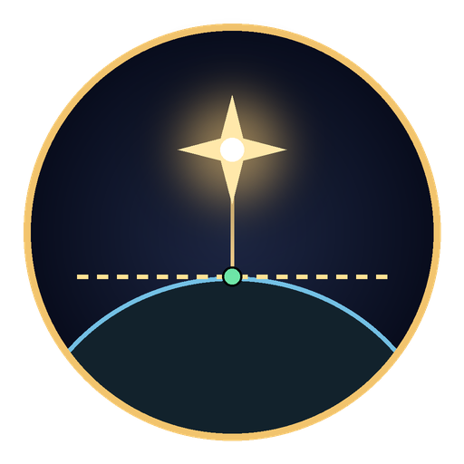
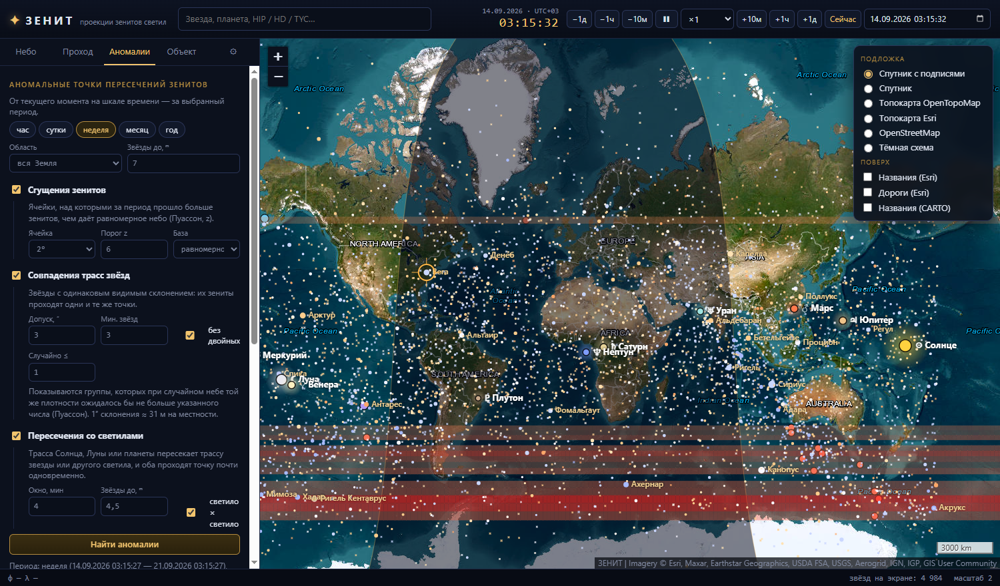

<p align="center"></p>

<h1 align="center">ЗЕНИТ (ZENIT)</h1>

<p align="center">
  <b>Проекции зенитов звёзд, Солнца, Луны и планет на реальной карте.</b><br>
  Когда зенит звезды пройдёт через ваш участок, по какой трассе — и где на Земле аномальные точки пересечений зенитов.
</p>

<p align="center">
  <a href="https://github.com/ignisdomini/zenith/releases/latest">Скачать для Windows</a> ·
  <a href="README.md">English</a>
</p>

---



## Возможности

Любое светило где-то на Земле стоит точно в зените. Это место — **подзвёздная точка**: её широта равна видимому склонению светила, долгота — прямому восхождению минус гринвичское истинное звёздное время. Земля вращается, и точка ползёт на запад со скоростью ~464 м/с × cos φ.

- **Живая карта зенитов** — 2,55 млн звёзд (HYG v4.1 + Tycho-2, до ~12ᵐ), Солнце, Луна, планеты и Плутон с русскими именами и обозначениями, терминатор, шкала времени с паузой и ускорением.
- **Проход через участок** — выделите прямоугольник или квадрат N×N км; программа найдёт все звёзды и светила, чей зенит пройдёт через него за период (от часа до 20 лет), с датой, временем входа и выхода, длительностью и трассой на карте.
- **Аномальные точки пересечений зенитов** за час, сутки, неделю, месяц или год:
  - *сгущения* — ячейки, над которыми прошло значимо больше зенитов, чем даёт равномерное небо (Пуассон, тепловая карта);
  - *совпадения трасс* — группы звёзд с одинаковым видимым склонением, которые на случайном небе встретились бы реже одного раза;
  - *пересечения со светилами* — трасса Солнца, Луны или планеты пересекает трассу звезды или другого светила, и оба проходят точку почти одновременно (так, например, находятся солнечные затмения).
- **Экспорт** в CSV, KML и KMZ.
- **Подложки** — спутниковые снимки Esri с подписями и дорогами, OpenTopoMap, топокарта Esri, OpenStreetMap, тёмная схема; кэш тайлов на диске и автономный режим.
- **Русский и английский интерфейс** — выбирается в установщике и в настройках.

## Установка

Скачайте `zenit-setup-<версия>.exe` в разделе [Releases](https://github.com/ignisdomini/zenith/releases). Установщик спросит язык (по умолчанию английский), папку и создаст ярлыки. Есть переносная версия `zenit-portable-<версия>.exe`.

Сборки пока не подписаны сертификатом, поэтому SmartScreen может предупредить о неизвестном издателе: «Подробнее» → «Выполнить в любом случае».

## Сборка из исходников

```bash
git clone https://github.com/ignisdomini/zenith.git
cd zenith
npm install
npm run catalog     # скачает HYG v4.1 и Tycho-2 (~200 МБ) в data/ и соберёт catalog/ (~80 МБ)
npm start
npm run dist        # установщик и переносная версия в dist/
```

## Точность

Звёзды — совпадение с эталоном astronomy-engine до 0,01″ (≈ 0,3 м). Солнце, Луна, планеты — VSOP87 и лунная теория astronomy-engine, точка зенита на эллипсоиде WGS-84, ≈ 1′ для планет. Не учтены уклонение отвеса (в горах до 30″), движение полюса (~10 м); DUT1 задаётся в настройках.

## Данные и лицензии

Код — [MIT](LICENSE). Звёздный каталог на основе HYG v4.1 — CC BY-SA 4.0. Tycho-2 — Høg et al. 2000, CDS I/259. astronomy-engine — MIT, Leaflet — BSD-2-Clause, Electron — MIT. Подложки — © Esri, © участники OpenStreetMap, © OpenTopoMap, © CARTO.

## Автор

**Апостол А. В.** — apostolgroup@gmail.com · +7 925 888-08-66
